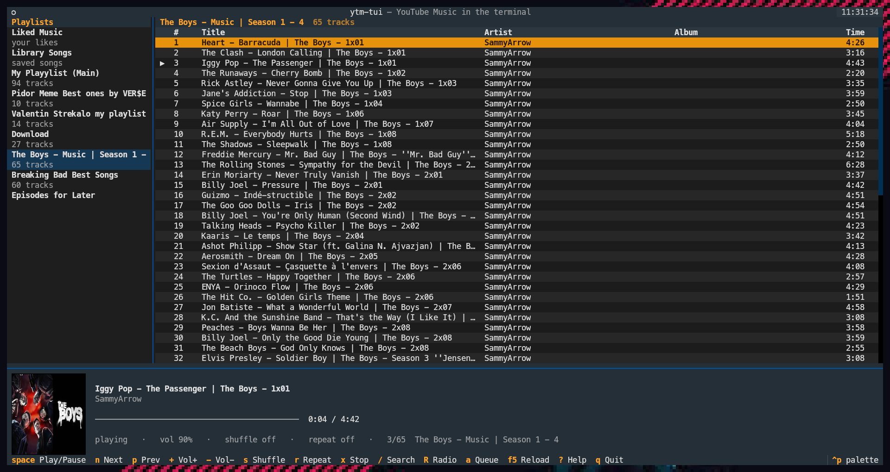
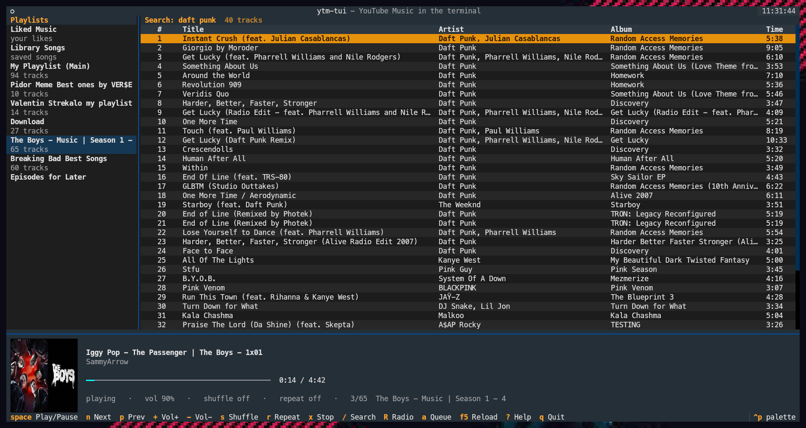
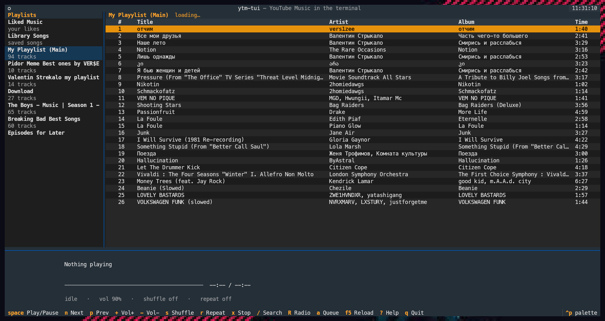

# ytm-tui

# [pls Don't forget to star this repo if you like it.]

A terminal music player for **your own YouTube Music account**. Browse your
playlists, liked songs and library, search, start radios, and play — all inside
your terminal, with real album art via the kitty graphics protocol.



<p align="center">
  
  
</p>

## Features

- Loads **your** YouTube Music playlists, Liked Music and Library Songs
- YouTube's own mixes — Supermix, My Mix, Discover, Replay — in the sidebar
- Full-text search across YouTube Music, songs and videos alike
- Blocked track? It finds another upload of the same song and plays that
- Start a radio from any track
- Gapless streaming — nothing is downloaded to disk, audio is piped into `mpv`
- Real album art in the terminal (kitty graphics protocol; unicode-block fallback
  elsewhere)
- Queue, shuffle, repeat, seek, volume — remembered between runs
- Sixteen themes — Tokyo Night, Gruvbox, Catppuccin, Nord, Dracula, two
  high-contrast ones and your terminal's own ANSI palette

## How it works

| Layer | Component |
|-------|-----------|
| Account, playlists, search | [`ytmusicapi`](https://github.com/sigma67/ytmusicapi) |
| Audio stream URLs | [`yt-dlp`](https://github.com/yt-dlp/yt-dlp) (cached, next track prefetched) |
| Playback | `mpv`, driven over its JSON IPC socket |
| Interface | [`textual`](https://github.com/Textualize/textual) + `textual-image` |

## Requirements

- Python 3.11+
- `mpv` and `ffmpeg` on your `PATH`
- A JavaScript runtime on your `PATH` — `deno`, `node`, `quickjs` or `bun`.
  YouTube signs its stream URLs with player JavaScript, and without an engine to
  run it yt-dlp silently drops formats and tracks fail to play.
  (`sudo apt install nodejs`, or see [deno.land](https://deno.land).)
- A terminal for best results **kitty** (album art). Works in others with
  unicode-block art.

## Install

```sh
git clone https://github.com/shuka0158/ytm-tui.git
cd ytm-tui
python3 -m venv .venv
.venv/bin/pip install -r requirements.txt
```

Then launch:

```sh
./ytm
```

The `ytm` launcher uses the project-local `.venv` and can be run from anywhere
(a shell, a `.desktop` shortcut, or inside kitty):

```sh
kitty --title ytm-tui -e /path/to/ytm-tui/ytm
```

## Connecting your account

With no credentials stored, `./ytm` drops straight into setup. You can also run
the steps explicitly:

```sh
./ytm setup     # connect a Google account
./ytm verify    # check the stored credentials still work
./ytm logout    # delete the stored credentials
```

### Sign in with browser headers

This app signs in by reusing your browser's YouTube Music session. It does **not**
ask for your password, and nothing is sent anywhere except YouTube's own API.

1. Open <https://music.youtube.com> signed in to the account you want.
2. Press `F12` → **Network** tab → type `browse` in the filter box, then click
   anything in the page so a request appears.
3. Click a **POST** request to `music.youtube.com` and copy its **request
   headers** as raw text:
   - **Chrome/Edge:** Headers tab → *Request Headers* → toggle **Raw** → select
     all → copy
   - **Firefox:** right-click the request → *Copy Value* → *Copy Request Headers*
4. Run `./ytm setup`, paste the whole block, and press `Ctrl-D`.

Credentials are stored in `config/browser.json` (git-ignored). The file is a
snapshot of your login, so it **survives reboots and your browser being closed or
killed** — it does not need the browser running. It ends only when the underlying
**Google session** is revoked or rotated.

### Make it survive browser logouts (recommended)

Cookies copied from your everyday browser share that browser's session
credential. If you later sign out of that browser, the session is revoked
server-side and the copy dies with it. To make the player independent of your
normal browsing, grab its cookies from a **throwaway session you never sign out
of**:

1. Open an **Incognito / Private** window — a fresh, isolated session.
2. Sign in to <https://music.youtube.com> and confirm your playlists load.
3. Copy the raw `browse` request headers as above.
4. Run `./ytm setup` and paste them.
5. **Close the Incognito window — do _not_ click "sign out" inside it.** Closing
   discards the local cookies but leaves the session alive on Google's side; the
   player keeps using it.

Now logging out of, closing, or rebooting your main browser does not affect the
player. Only a **password change**, **"sign out of all devices"**, or a
Google-forced re-auth will end it. When the library shows up empty, redo the
steps above.

> **Why not OAuth?** A Google "TVs and Limited Input devices" OAuth client
> authenticates and refreshes forever, but Google blocks device-OAuth tokens from
> the internal `youtubei` API that `ytmusicapi` uses — *every* call (search, home,
> library) returns HTTP 400. There is no forever-token for a third-party YouTube
> Music client that actually works; browser headers are the only functioning
> method.

## Keys

| Key | Action |
|-----|--------|
| `enter` | play the highlighted track |
| `space` | play / pause |
| `n` / `p` | next / previous track |
| `←` / `→` | seek 5s (`shift` for 30s) |
| `+` / `-` | volume |
| `s` | shuffle |
| `r` | repeat: off → all → one |
| `x` | stop |
| `/` | search YouTube Music |
| `R` | start a radio from the highlighted track |
| `a` | append the highlighted track to the queue |
| `F5` | reload playlists |
| `t` | theme picker |
| `tab` | move between panes |
| `?` | help |
| `q` | quit |

Volume, shuffle, repeat and the theme are remembered in `config/settings.json`.

### Themes

`t` opens the picker; moving the highlight previews the theme live, `enter`
keeps it, `esc` puts the old one back. Sixteen to choose from:

Tokyo Night (default), Catppuccin Mocha, Gruvbox, Nord, Dracula, Monokai,
Rosé Pine, Solarized Dark, Textual Dark, **High Contrast**, Terminal (dark ANSI),
Catppuccin Latte, Solarized Light, Textual Light, **High Contrast Light**,
Terminal (light ANSI).

The two high-contrast themes are pure black-on-white and white-on-black with
nothing dimmed; every accent in them clears 7:1 against the background, which is
WCAG AAA. The two Terminal themes paint with the sixteen ANSI colours your own
terminal is configured with, so ytm-tui matches whatever the rest of your shell
looks like.

You can also set it by hand — `"theme": "gruvbox"` in `config/settings.json`.
An unknown name falls back to the default instead of failing to start.

### Mixes

The sidebar lists YouTube's personalised mixes for your account — Supermix,
My Mix 1-5, Discover Mix, Replay Mix, New Release Mix — above your own
playlists, and they play like any other playlist. They are refreshed from
YouTube Music's home feed on each start, so the set changes as your listening
does.

They are picked out by playlist id rather than by the heading YouTube gives
them, so this keeps working whatever language your account is set to.

### Tracks that need a sign-in

Most tracks play anonymously, and that is deliberate: YouTube refuses to serve
streams to a cookie-authenticated request, answering with *"The page needs to be
reloaded"* and no formats at all. Sending your session on every track would break
the tracks that currently work.

So the player resolves anonymously first, and only retries with a signed-in
session when YouTube specifically answers *"Sign in to confirm your age"*.

That session is free: `ytm setup` already captures a signed-in
music.youtube.com request, so the cookies get exported to `config/cookies.txt`
automatically. There is nothing extra to do.

To check what would be used, or to override it:

```sh
ytm cookies                      # what the retry would send
ytm cookies login                # open the YouTube sign-in page
ytm cookies detect               # browser profiles signed in to YouTube
ytm cookies "chrome:Profile 2"   # use a browser profile instead
ytm cookies file ~/cookies.txt   # use a Netscape cookies.txt instead
ytm cookies auto                 # back to the session from `ytm setup`
```

Reading a Chromium-based browser's cookie store needs `secretstorage` (already
in `requirements.txt`) and a running keyring; Firefox needs neither.

**When a track is blocked anyway.** A few uploads are refused to the player even
with a signed-in, age-verified account. YouTube wants the attestation a real
browser produces, and no cookie, browser profile or client override substitutes
for it — such an upload usually still plays fine on youtube.com.

Rather than give up, the player looks for **another upload of the same song** and
plays that instead. Covers, re-uploads and mirrors are rarely restricted the way
the original is. You are told when it happens, never silently swapped:

```
"<title>" is blocked - playing another upload: "<other title>"
```

Candidates have to earn it. A match needs a similar title, compared after
stripping noise words like *official*, *remaster* and *HD*, and a duration within
25% of the original. That length check is what keeps a 40-second snippet sharing
a title out of your queue — playing the wrong thing is worse than playing
nothing. Up to three candidates are resolved at once and the best-matching one
that actually works wins.

The first blocked track costs a few seconds while it searches. After that both
the verdict and the substitution are remembered, so playing it again is instant,
and the next track in the queue is checked ahead of time while the current one
plays.

If nothing suitable exists, it says so and moves on:

```
age-restricted: YouTube refused this to the player even signed in.
It normally still plays on youtube.com in a browser.
```

**PO tokens (optional).** YouTube increasingly asks for a proof-of-origin token
on authenticated requests. yt-dlp can produce one via a provider plugin, which
needs Deno (or Node 22+):

```sh
.venv/bin/pip install bgutil-ytdlp-pot-provider
git clone https://github.com/Brainicism/bgutil-ytdlp-pot-provider ~/bgutil-ytdlp-pot-provider
cd ~/bgutil-ytdlp-pot-provider/server && npm install && npx tsc
```

This is not required — the player works without it. Earlier testing of the
age-restricted case above was against a signed-in retry that (by a since-fixed
bug) never actually reached the web client, so it wasn't a fair test of what a
PO token can unlock; it's worth trying again if you're hitting that message
often. It also silences the "GVS PO Token which was not provided" warnings
regardless, and is likely to matter more over
time.

### When something will not play

```sh
ytm doctor
```

Checks `mpv`, the JavaScript runtime, your stored account and the session used
for gated tracks, and names whatever is missing.

## Maintenance

`yt-dlp` breaks whenever YouTube changes something, so if playback fails while
playlists still load, update it first:

```sh
.venv/bin/pip install -U yt-dlp
```

To rebuild the environment from scratch:

```sh
rm -rf .venv && python3 -m venv .venv
.venv/bin/pip install -r requirements.txt
```

##  Notes & disclaimer

This is an unofficial client that uses private YouTube Music endpoints via
`ytmusicapi`. It is not affiliated with, endorsed by, or supported by Google or
YouTube. Use it with your own account, at your own risk.

## License

[GNU General Public License v3.0 or later](LICENSE) (`GPL-3.0-or-later`).

This is copyleft: anyone may use, study, modify and redistribute this program,
but any copy or derivative work that is distributed must also be released under
the GPL, with source included. Closed-source forks are not permitted.

    ytm-tui - a terminal player for your YouTube Music account.
    Copyright (C) 2026 shuka0158

    This program is free software: you can redistribute it and/or modify it
    under the terms of the GNU General Public License as published by the Free
    Software Foundation, either version 3 of the License, or (at your option)
    any later version.

    This program is distributed in the hope that it will be useful, but
    WITHOUT ANY WARRANTY; without even the implied warranty of
    MERCHANTABILITY or FITNESS FOR A PARTICULAR PURPOSE. See the GNU General
    Public License for more details.

    You should have received a copy of the GNU General Public License along
    with this program. If not, see <https://www.gnu.org/licenses/>.

Run `./ytm license` for the same notice at the terminal.

### Dependency licenses

All runtime dependencies are GPLv3-compatible:

| Dependency | License |
|------------|---------|
| `textual`, `rich`, `ytmusicapi` | MIT |
| `textual-image` | LGPL-3.0-or-later |
| `pillow` | MIT-CMU |
| `requests` | Apache-2.0 |
| `yt-dlp` | Unlicense (public domain) |
| `mpv`, `ffmpeg` | GPL/LGPL — invoked as separate processes, not linked |

### Note on the earlier MIT release

Commit `8a7eb1a` was published under the MIT license. That release stays MIT
forever and cannot be revoked — anyone who obtained that snapshot may keep using
it on MIT terms. Everything from the relicensing commit onward is GPLv3.
